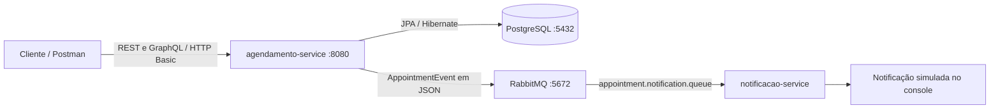

# Hospital Management API

Backend de gerenciamento hospitalar desenvolvido para o **Tech Challenge — Fase 3 da Pós Tech FIAP**. O projeto reúne cadastro de usuários, pacientes e médicos, agendamento de consultas, controle de acesso por perfil e comunicação assíncrona entre serviços.

## Sumário

- [Escopo e tecnologias](#escopo-e-tecnologias)
- [Arquitetura](#arquitetura)
- [Requisitos](#requisitos)
- [Execução passo a passo](#execução-passo-a-passo)
- [Credenciais e preparação da demonstração](#credenciais-e-preparação-da-demonstração)
- [Segurança e matriz de permissões](#segurança-e-matriz-de-permissões)
- [API REST](#api-rest)
- [GraphQL](#graphql)
- [Mensageria](#mensageria)
- [Postman](#postman)
- [Estrutura do projeto](#estrutura-do-projeto)
- [Build e roteiro de validação](#build-e-roteiro-de-validação)

## Escopo e tecnologias

| Componente | Implementação |
| --- | --- |
| Linguagem e framework | Java 21 e Spring Boot 4.1.1 |
| API | Spring Web MVC, REST e Spring GraphQL |
| Persistência | Spring Data JPA / Hibernate e PostgreSQL 16 |
| Segurança | Spring Security, HTTP Basic e senhas com BCrypt |
| Mensageria | Spring AMQP e RabbitMQ `3-management` |
| Validação e apoio | Bean Validation e Lombok no serviço de agendamento |
| Execução e testes manuais | Maven Wrapper, Docker Compose e Collection Postman |

Funcionalidades implementadas:

- Cadastro de usuários com os perfis `DOCTOR`, `NURSE` e `PATIENT`.
- Criação de perfis de médico e paciente vinculados a usuários.
- Criação, listagem, busca por ID e atualização de consultas via REST.
- Consultas GraphQL para listagem geral, por paciente e por datas futuras.
- Restrição de leitura para que pacientes acessem somente suas próprias consultas.
- Publicação dos eventos `APPOINTMENT_CREATED` e `APPOINTMENT_UPDATED`.
- Consumo dos eventos com **simulação de notificação no console**.

A implementação não envia e-mail ou SMS e não possui rotina de lembretes programados. O histórico consultável corresponde aos registros de consultas; não há prontuário clínico ou histórico de versões das alterações.

## Arquitetura



| Serviço | Responsabilidade |
| --- | --- |
| `agendamento-service` | Autenticação, autorização, regras de negócio, persistência, REST, GraphQL e publicação dos eventos. |
| `notificacao-service` | Consumo da fila RabbitMQ e exibição dos dados do evento no console; não expõe API HTTP. |

O [Docker Compose](docker-compose.yml) inicia **PostgreSQL e RabbitMQ**. Os dois serviços Java são executados separadamente, pelo Maven Wrapper.

### Modelo de domínio

- **User:** identidade de autenticação, com nome, e-mail único, senha e perfil.
- **Patient:** vínculo um para um com um `User` de perfil `PATIENT`.
- **Doctor:** vínculo um para um com um `User` de perfil `DOCTOR`.
- **Appointment:** consulta vinculada a um paciente e um médico, com data/hora, status e observações.

Os status são `SCHEDULED`, `COMPLETED` e `CANCELED`. A criação atribui `SCHEDULED` automaticamente; a atualização permite informar um desses três valores.

## Requisitos

- JDK **21**, com `JAVA_HOME` configurado.
- Docker em execução e Docker Compose disponível (`docker compose`).
- Git para obter o repositório.
- Postman para utilizar a Collection, ou cURL para executar os exemplos.
- Portas locais `8080`, `5432`, `5672` e `15672` disponíveis.
- Acesso à internet na primeira execução para baixar imagens e dependências.

O Maven Wrapper está incluído em cada serviço; não é necessário instalar Maven globalmente. Os comandos abaixo usam terminal Unix/macOS. No Windows, utilize `mvnw.cmd` no lugar de `./mvnw`.

## Execução passo a passo

### 1. Obter o projeto

```bash
git clone https://github.com/ricfreittas/hospitalapi-fase3-fiap.git
cd hospitalapi-fase3-fiap
```

Se o repositório já estiver clonado, abra um terminal na sua pasta raiz.

### 2. Iniciar PostgreSQL e RabbitMQ

```bash
docker compose up -d
docker compose ps
docker compose logs postgres rabbitmq
```

Aguarde o PostgreSQL aceitar conexões e o RabbitMQ concluir a inicialização antes de iniciar os serviços Java.

| Recurso | Endereço / configuração | Credenciais locais |
| --- | --- | --- |
| PostgreSQL | `localhost:5432`, banco `agendamento_db` | `postgres` / `postgres` |
| RabbitMQ (AMQP) | `localhost:5672` | `guest` / `guest` |
| Painel RabbitMQ | <http://localhost:15672> | `guest` / `guest` |

### 3. Iniciar o serviço de agendamento

Em um terminal, a partir da raiz:

```bash
cd agendamento-service
./mvnw spring-boot:run
```

A API atende em <http://localhost:8080>. O Hibernate cria ou atualiza as tabelas com `ddl-auto: update`. Aguarde a inicialização concluir: este serviço também declara a exchange, a fila e o vínculo de roteamento no RabbitMQ.

### 4. Iniciar o serviço de notificação

Em **outro terminal**, a partir da raiz:

```bash
cd notificacao-service
./mvnw spring-boot:run
```

O consumidor passa a aguardar mensagens em `appointment.notification.queue`. Inicie-o após o serviço de agendamento, pois ele depende dessa fila já criada.

### 5. Preparar os dados e acessar a API

Siga a próxima seção para preparar uma base vazia. Com um usuário existente, uma consulta de leitura pode ser feita assim:

```bash
curl -i --user 'maria@hospital.com:123456' \
  http://localhost:8080/appointments
```

Com a enfermeira cadastrada e sem consultas, a resposta esperada é `200 OK` com `[]`.

### Encerrar o ambiente

Encerre cada serviço Java com `Ctrl+C`. Na raiz, execute:

```bash
docker compose down
```

O PostgreSQL usa o volume nomeado `agendamento_postgres_data`, preservado por esse comando. O RabbitMQ não possui volume persistente configurado no Compose.

## Credenciais e preparação da demonstração

| Perfil | E-mail | Senha de demonstração |
| --- | --- | --- |
| `NURSE` | `maria@hospital.com` | `123456` |
| `DOCTOR` | `marcos@hospital.com` | `123456` |
| `PATIENT` | `joao@email.com` | `123456` |

**Esses usuários não são criados automaticamente.** Não há carga inicial no repositório, e `POST /users` já exige autenticação de médico ou enfermeiro. Em uma base existente, utilize as credenciais realmente cadastradas. Em uma base vazia, faça a preparação manual abaixo.

### 1. Cadastrar a primeira enfermeira na base local

Após o serviço de agendamento criar as tabelas, execute na raiz do projeto:

```bash
docker compose exec -T postgres psql -U postgres -d agendamento_db <<'SQL'
INSERT INTO users (name, email, password, role)
VALUES (
  'Maria',
  'maria@hospital.com',
  '$2y$10$mBpVAJQOYiGkEj8OjBsiZeyIdcyPMV/W8nhtgm9es1gdCuaDIMxPS',
  'NURSE'
)
ON CONFLICT (email) DO NOTHING;
SQL
```

O valor armazenado é um hash BCrypt da senha de demonstração `123456`. Este é um procedimento manual para preparar o ambiente local, não uma funcionalidade de cadastro automático. Se o e-mail já existir, o comando preserva o usuário e sua senha atual.

### 2. Criar os usuários médico e paciente pela API

```bash
curl -i --user 'maria@hospital.com:123456' \
  -H 'Content-Type: application/json' \
  -d '{"name":"Marcos","email":"marcos@hospital.com","password":"123456","role":"DOCTOR"}' \
  http://localhost:8080/users

curl -i --user 'maria@hospital.com:123456' \
  -H 'Content-Type: application/json' \
  -d '{"name":"João","email":"joao@email.com","password":"123456","role":"PATIENT"}' \
  http://localhost:8080/users
```

Anote o `id` de cada resposta. Para cada usuário, crie o perfil correspondente via `POST /doctors` ou `POST /patients`, conforme os exemplos REST abaixo. Não repita cadastros de e-mails ou vínculos já existentes.

**Os IDs de usuário, médico e paciente são distintos.** Use o `id` retornado pelo cadastro do perfil como `doctorId` ou `patientId` ao criar consultas. As credenciais desta seção destinam-se à demonstração local.

## Segurança e matriz de permissões

Todas as rotas implementadas exigem **HTTP Basic**, usando o e-mail como nome de usuário. As senhas são armazenadas com BCrypt. Não há endpoint de login ou emissão de token: envie as credenciais em cada requisição.

| Operação | `DOCTOR` | `NURSE` | `PATIENT` |
| --- | --- | --- | --- |
| `POST /users` | Permitido | Permitido | Negado |
| `POST /patients` | Permitido | Permitido | Permitido |
| `POST /doctors` | Permitido | Permitido | Permitido |
| `POST /appointments` | Permitido | Permitido | Negado |
| `PUT /appointments/{id}` | Permitido | Permitido | Negado |
| `GET /appointments` | Todas | Todas | Somente próprias |
| `GET /appointments/{id}` | Qualquer consulta | Qualquer consulta | Somente própria |
| GraphQL `appointments` | Todas | Todas | Somente próprias |
| GraphQL `appointmentsByPatient` | Qualquer paciente | Qualquer paciente | Somente o próprio paciente |
| GraphQL `futureAppointmentsByPatient` | Qualquer paciente | Qualquer paciente | Somente o próprio paciente |

A matriz reflete a configuração existente: `/patients` e `/doctors` exigem apenas autenticação. A regra de negócio verifica se o **usuário indicado por `userId`** tem o perfil apropriado; não restringe esses cadastros a médicos ou enfermeiros. Médicos podem consultar e alterar agendamentos de outros médicos.

## API REST

**URL base:** `http://localhost:8080`. Para corpos de requisição, envie `Content-Type: application/json`.

| Método | Endpoint | Descrição | Sucesso |
| --- | --- | --- | --- |
| `POST` | `/users` | Cadastra usuário e codifica a senha com BCrypt. | `201 Created` |
| `POST` | `/patients` | Vincula um usuário `PATIENT` ao perfil de paciente. | `201 Created` |
| `POST` | `/doctors` | Vincula um usuário `DOCTOR` ao perfil de médico. | `201 Created` |
| `POST` | `/appointments` | Cria consulta com status `SCHEDULED`. | `201 Created` |
| `GET` | `/appointments` | Lista consultas conforme o usuário autenticado. | `200 OK` |
| `GET` | `/appointments/{id}` | Busca uma consulta e verifica o acesso do paciente. | `200 OK` |
| `PUT` | `/appointments/{id}` | Atualiza paciente, médico, data/hora, status e observações. | `200 OK` |

### Cadastro de usuário

`POST /users` — autentique como `DOCTOR` ou `NURSE`:

```json
{
  "name": "João",
  "email": "joao@email.com",
  "password": "123456",
  "role": "PATIENT"
}
```

Os quatro campos são obrigatórios e o e-mail deve ter formato válido. A resposta contém `id`, `name`, `email` e `role`, sem a senha.

### Cadastro dos perfis

`POST /patients` ou `POST /doctors` — substitua o valor pelo ID de um usuário com o perfil correspondente:

```json
{
  "userId": 2
}
```

A resposta contém `id` do perfil, `userId`, `name` e `email`. Cada usuário pode ter apenas um vínculo do respectivo tipo.

### Criação de consulta

`POST /appointments` — substitua os IDs pelos perfis existentes e escolha uma data futura em relação ao relógio do serviço:

```json
{
  "patientId": 1,
  "doctorId": 1,
  "appointmentDateTime": "2030-11-20T10:00:00",
  "notes": "Consulta de acompanhamento"
}
```

`patientId`, `doctorId` e `appointmentDateTime` são obrigatórios. A data usa `LocalDateTime`, no formato `AAAA-MM-DDTHH:mm:ss`, sem offset de fuso. `notes` é opcional. Não há verificação implementada de conflito de horários.

### Atualização de consulta

`PUT /appointments/1` — substitua o ID da URL e os IDs do corpo:

```json
{
  "patientId": 1,
  "doctorId": 1,
  "appointmentDateTime": "2030-11-25T14:00:00",
  "status": "SCHEDULED",
  "notes": "Consulta reagendada"
}
```

Envie todos os campos obrigatórios: paciente, médico, data/hora e status. A atualização não aplica a validação de data futura usada na criação. Para registrar cancelamento ou conclusão, use `CANCELED` ou `COMPLETED` neste endpoint; não há rota `DELETE`.

Criação e atualização retornam `id`, `patientId`, `doctorId`, `appointmentDateTime`, `status` e `notes`, e publicam o evento correspondente.

### Respostas de erro

- `400 Bad Request`: falha de validação dos campos de entrada.
- `401 Unauthorized`: autenticação ausente ou inválida.
- `403 Forbidden`: operação não permitida para o perfil ou acesso a consulta de outro paciente.
- `404 Not Found`: recurso não encontrado; também é usado quando o usuário informado não tem o perfil exigido no cadastro de médico/paciente.

O tratamento REST de validação, recurso ausente e acesso negado pela regra de negócio retorna `timestamp`, `status`, `error`, `message` e `path`. Erros da camada de segurança podem ter outro formato. E-mail duplicado lança uma exceção sem tratamento específico; não há resposta `409` implementada para esse caso.

## GraphQL

**Endpoint:** `POST http://localhost:8080/graphql`, com HTTP Basic. O [schema](agendamento-service/src/main/resources/graphql/schema.graphqls) disponibiliza as três queries abaixo; não há mutations.

### Listar consultas acessíveis ao usuário

```graphql
query {
  appointments {
    id
    patientId
    doctorId
    appointmentDateTime
    status
    notes
  }
}
```

### Consultar por paciente

Substitua `1` pelo ID do perfil do paciente:

```graphql
query {
  appointmentsByPatient(patientId: 1) {
    id
    patientId
    doctorId
    appointmentDateTime
    status
    notes
  }
}
```

### Consultar datas futuras de um paciente

```graphql
query {
  futureAppointmentsByPatient(patientId: 1) {
    id
    patientId
    doctorId
    appointmentDateTime
    status
    notes
  }
}
```

O filtro considera data/hora **posterior ao momento atual do serviço**, independentemente do status. Assim, registros futuros com status `CANCELED` ou `COMPLETED` também podem aparecer.

### Enviar uma query por HTTP

```bash
curl -i --user 'marcos@hospital.com:123456' \
  -H 'Content-Type: application/json' \
  -d '{"query":"query { appointments { id patientId doctorId appointmentDateTime status notes } }"}' \
  http://localhost:8080/graphql
```

No Postman, use **Body → raw → JSON** com o objeto `{"query":"..."}`. Em uma requisição GraphQL autenticada, a tentativa de acessar outro paciente é representada no campo `errors` da resposta; não avalie a autorização apenas pelo status HTTP.

## Mensageria

| Configuração | Valor |
| --- | --- |
| Exchange do tipo direct | `appointment.exchange` |
| Routing key | `appointment.notification` |
| Fila durável | `appointment.notification.queue` |
| Conversão da mensagem | JSON com `JacksonJsonMessageConverter` |
| Evento de criação | `APPOINTMENT_CREATED` |
| Evento de atualização | `APPOINTMENT_UPDATED` |

Fluxo implementado:

1. O `agendamento-service` salva a criação ou atualização da consulta no PostgreSQL.
2. Publica um `AppointmentEvent` na exchange, usando a routing key configurada.
3. O RabbitMQ encaminha a mensagem para a fila vinculada.
4. O `notificacao-service` consome a mensagem com `@RabbitListener` e imprime seus dados.

O contrato `AppointmentEvent` contém `eventType`, `appointmentId`, `patientId`, `doctorId` e `appointmentDateTime`. Status e observações não fazem parte do evento.

Para demonstrar o fluxo, crie uma consulta e depois atualize-a. No terminal do consumidor, procure `NOTIFICATION RECEIVED`, seguido de `Event: APPOINTMENT_CREATED` ou `Event: APPOINTMENT_UPDATED` e dos dados da consulta. A exchange e a fila podem ser inspecionadas no [painel RabbitMQ](http://localhost:15672).

## Postman

Importe a [Collection Hospital API — FIAP 2026](postman/Hospital%20API%20-%20FIAP%202026.postman_collection.json), no formato Collection v2.1.

### Configurar as variáveis da Collection

As variáveis exportadas estão **vazias** e precisam ser preenchidas:

| Variável | Valor para a demonstração |
| --- | --- |
| `baseUrl` | `http://localhost:8080` |
| `doctorEmail` | `marcos@hospital.com` |
| `doctorPassword` | `123456` |
| `nurseEmail` | `maria@hospital.com` |
| `nursePassword` | `123456` |
| `patientEmail` | `joao@email.com` |
| `patientPassword` | `123456` |
| `patientId` | ID retornado por `POST /patients` |
| `doctorId` | ID retornado por `POST /doctors` |
| `appointmentId` | ID retornado por `POST /appointments` |

### Executar a demonstração

1. Prepare a enfermeira inicial conforme a seção de credenciais.
2. Na pasta **Users**, adapte o corpo de `POST Create User` para cadastrar médico e paciente. O exemplo exportado cria `Lucas Teste` com perfil `DOCTOR`.
3. Nas pastas **Patients (Pacientes)** e **Doctors**, troque os `userId` fixos (`6` e `7`) pelos IDs dos usuários correspondentes.
4. Preencha `patientId` e `doctorId`. Na pasta **Appointments**, atualize a data de criação para um instante futuro e execute o cadastro.
5. Copie o ID retornado para `appointmentId`; execute listagem, leitura como paciente e atualização. A Collection não captura esses IDs automaticamente.
6. Na pasta **GraphQL**, utilize os exemplos com corpo preenchido, como `GET All Appointments - Doctor`. Apesar do nome começar com `GET`, as requisições GraphQL usam **POST**.
7. Para `Forbidden - Patient Access Another Patient`, crie outro paciente e substitua o `patientId: 2` fixo pelo ID dele. Autentique como o primeiro paciente e verifique `errors` na resposta.
8. Confira os eventos de criação e atualização no console do `notificacao-service`.

A requisição GraphQL chamada `GET All Appointments` está sem corpo e sem autenticação explícita; preencha ambos conforme os exemplos deste README ou utilize `GET All Appointments - Doctor`. Ela e o exemplo de acesso proibido usam URL fixa `http://localhost:8080/graphql`: ajuste essas URLs manualmente se alterar o endereço da API.

A Collection contém exemplos de requisições, sem scripts de asserção automática. Verifique manualmente os resultados e as regras de acesso.

## Estrutura do projeto

```text
hospitalapi-fase3-fiap/
├── agendamento-service/
│   ├── .mvn/wrapper/
│   ├── src/main/java/br/com/hospitalapi/agendamento/
│   │   ├── config/          # Configuração de segurança
│   │   ├── controller/      # Endpoints REST
│   │   ├── dto/             # Contratos de entrada e saída
│   │   ├── exception/       # Tratamento de erros REST
│   │   ├── graphql/         # Resolvers e tratamento de erros GraphQL
│   │   ├── messaging/       # Configuração RabbitMQ e publicação
│   │   ├── model/           # Entidades e enums
│   │   ├── repository/      # Acesso ao PostgreSQL
│   │   └── service/         # Regras de negócio e autenticação
│   ├── src/main/resources/
│   │   ├── application.yaml
│   │   └── graphql/schema.graphqls
│   ├── src/test/
│   ├── mvnw
│   ├── mvnw.cmd
│   └── pom.xml
├── notificacao-service/
│   ├── .mvn/wrapper/
│   ├── src/main/java/br/com/hospitalapi/notificacao/
│   │   └── messaging/       # Contrato, conversor JSON e consumidor
│   ├── src/main/resources/application.yaml
│   ├── src/test/
│   ├── mvnw
│   ├── mvnw.cmd
│   └── pom.xml
├── postman/
│   └── Hospital API - FIAP 2026.postman_collection.json
├── .gitignore
├── docker-compose.yml
└── README.md
```

## Build e roteiro de validação

Com PostgreSQL e RabbitMQ disponíveis e a fila já declarada, execute os comandos abaixo **a partir da raiz do projeto**:

```bash
(cd agendamento-service && ./mvnw clean package)
(cd notificacao-service && ./mvnw clean package)
```

Os testes existentes carregam o contexto Spring (`contextLoads`); não representam cobertura automatizada das regras de negócio. Cada build deve terminar com `BUILD SUCCESS` e gerar o JAR em `target/` do respectivo serviço.

Para a apresentação da entrega:

- [ ] Iniciar a infraestrutura e os dois serviços sem erros de conexão.
- [ ] Preparar os usuários e vincular os perfis de médico e paciente.
- [ ] Criar e atualizar uma consulta autenticando como médico ou enfermeiro.
- [ ] Confirmar os dois tipos de evento no console do consumidor.
- [ ] Consultar agendamentos por REST e pelas três queries GraphQL.
- [ ] Demonstrar que um paciente vê apenas suas próprias consultas.
- [ ] Demonstrar o bloqueio de acesso aos dados de outro paciente.
- [ ] Demonstrar o bloqueio de criação/atualização de consultas por paciente.

## Autor

Ricardo Freitas — Tech Challenge, Fase 3, Pós Tech FIAP.
